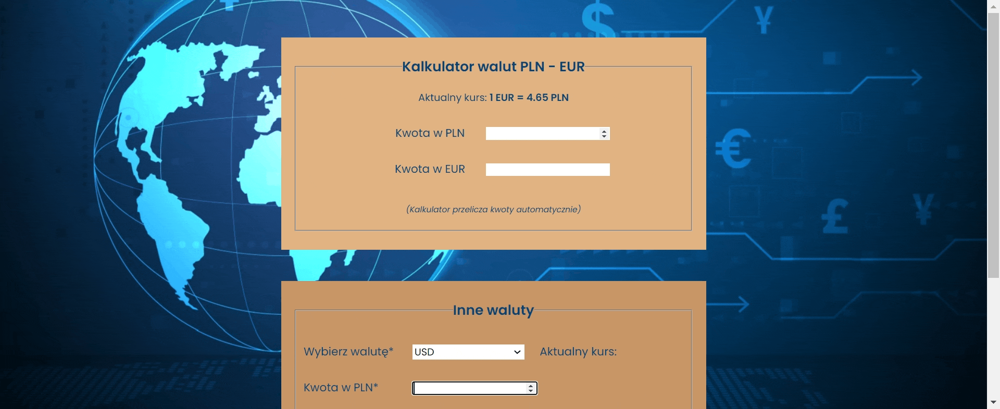

# Currency converter
# Demo
https://ewa14.github.io/currency-converter/
## Description
A simple currency converter created using two forms. 

The first form converts PLN to EUR and EUR to PLN in real time - all you need to do is input the amount in the initial currency and you'll get the result in target currency immediately.

The second form lets you convert PLN to USD or CHF. First, select the target currency, then enter the amount in PLN,  and click the button "Przelicz". The result of the exchange will be displayed under the button.
## Technologies used
- HTML
- CSS
- BEM naming convention
- JavaScript
- ES6 features (e.g. arrow functions, "const" keywords, template literals)
## Preview
